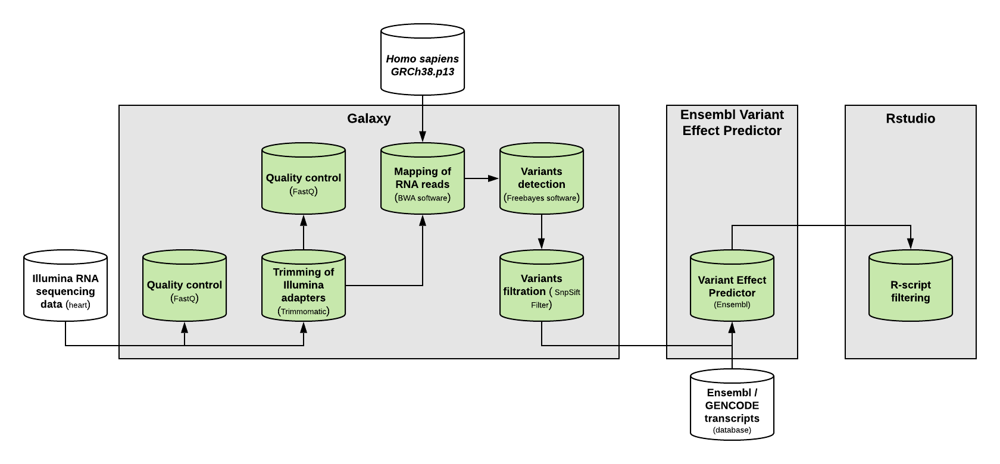

# A workflow to identify cardiovascular diseases
*A Bioinformatics minor project.*

**Introduction**

At this time, one out of every three people will die of cardiovascular diseases. Which makes it the number one killer of humanity. In 2016, ischaemic heart disease and stroke were the main cause deaths worldwide. Which was a total of 15.2 million deaths in 2016. In the United States, heart diseases are the number one cause of deaths with a total of 23.1% of deaths in 2017. There are various types of heart diseases including conditions that affect the structure/function of the heart and blood vessel. Most are largely preventable and death rates are decreasing due to advances in prevention. Identifying the people at risk is the first step towards developing treatment strategies for cardiovascular diseases. By identifying genetic variants in RNA sequencing data with bioinformatics we can predict which cardiovascular diseases may occur. 

**Goal of the project**

The goal of this project is to create a workflow in the Galaxy platform that identifies these variants, that may underly cardiovascular diseases. Various tools will be used to check the quality, prepare the RNA sequences, and alignment to a reference genome. The resulting alignment will be used to determine if there are any variations present. The RNA sequence data for the project is provided by Utrecht UMC.

**Approach of the project**

In this project, we have created a workflow to identify genetic variants that may underly cardiovascular diseases. This workflow starts with a quality control on the RNA sequence data. An publicly available dataset was used to create the workflow. Where needed, quality was improved by trimming the dataset. The good quality output was used to map and align to the human reference genome (*Homo sapiens GRCh38.p13*). After that, variants are determined and checked on quality. The variants with a good quality score are used for the hazard determination in the Ensembl Variant Effect Predictor (VEP) tool. This output is edited in R-Studio to a clear spreadsheet. 

# Workflow

The workflow consists of 3 parts: Galaxy, Variant Effect Predictor and the R-script (see image above). 
In the galaxy pipeline, the quality of the Illumina sequencing data is assessed and processed. The processing consists of trimming and mapping of the reads. The reads are mapped against the human reference genome (*Homo sapiens GRCh38.p13*). The output is sorted and duplicates are marked and deleted. The resulting BAM file then needs to go through Freebayes for the detection of variants which results in a vcf file. Then the low-quality score variants are filtered away.

The Variant Effect Predictor (VEP) program uses the filtered vcf file to predict the effect of each gene and outputs a tab-delimited text file containing information of every detected variants by Freebayes. 

Rstudio runs the VEP output through an R-script, filtering any unwanted information. The filtering is based on the PolyPhen and Sift scores, the missense mutation and known heart disease-causing genes provided in the gene_list.csv file. The script runs 3 filters on the text file, The first filter filters everything that doesn’t contain a missense mutation, a high PolyPhen score and a low Sift score and the provided heart disease-causing genes. The second filter filters everything that doesn’t contain a missense mutation, a high PolyPhen score and the provided heart disease-causing genes. And the last filter filters everything that doesn’t contain a missense mutation, a low Sift score and the provided heart disease-causing genes.
All 3 filters also output an extra file, a list of all possibly heart disease-causing variants.

# Tools
1) **Private Galaxy:**
 - FastQC             *Galaxy Version 0.72*
 - Trimmomatic        *Galaxy Version 0.36.5*
 - BWA                *Galaxy Version 0.7.17.4*
 - SortSam            *Galaxy Version 2.18.2.1*
 - MarkDuplicates     *Galaxy Version 2.18.2.2*
 - Freebayes          *Galaxy Version 1.3.1*
 - SnpSift Filter     *Galaxy Version 4.3*
 - Rstudio (optional) *Version 1.3.959*

2) **Ensembl’s Variant Effect Predictor webpage**

3) **Rstudio *Version 1.3.959***

# Manual
**Step 1:**
Perform quality control on the Illumina sequencing data in Galaxy with FastQC and look at the result.

**Step 2:**
Run the  Illumina sequencing data through the Galaxy pipeline (Galaxy-Workflow-Project_pipeline_to_identify_Variants.ga), which is available in the Github repository, in the private Galaxy to identify the variants with the following settings:

(**WARNING:** Ensembl’s Variant Effect Predictor is unable to run large data sizes, if the output is too large for VEP, try using Lofreq instead of Freebayes for variant calling. NOTE a locally cached reference genome needs to be provided for Lofreq)
 - Indicate in the Trimmomatic tool if your data is Single-end or paired-end reads.
 - Insert a HEADCROP operation in the Trimmomatic tool and indicate the number of bases to remove from the start with the information of the quality control in step 1.
 - Indicate in the BWA tool to use the *GRCh38/hg38* as the reference genome and if the input is a Single-end or paired-end read.
 - Indicate in the MarkDuplicates tool to do not write duplicates to the output file.
 - Indicate in the Freebayes tool to use the *GRCh38/hg38* as the reference genome.
 - Indicate in the SnpSift Filter tool the Filter criteria with ‘( QUAL > 20 )’.

**Step 3:**
Run the resulting vcf file from step 2 through Ensembl’s Variant Effect Predictor against the Ensembl/GENCODE transcripts database with default settings and download the txt file. Optionally you can run it with an R-script with the Bioconductor package on a Linux or MAC operating system.

**Step 4:**
Download the gene_list.csv file and rename the txt file to r_script_input.txt.
Run the R-script (r-script_disease_causing_genes_filtering_V2_with_english_comments.R) provided in the Github repository on the txt file to filter unneeded information with Rstudio, which can be done in Galaxy or on your local device. But first set a working directory (all the files needs to be in the working directory for the script to work properly). 

You can find an example of the output in this GitHub repository in the Datasets_generated_analysed_during_project/R-script_output folder.

